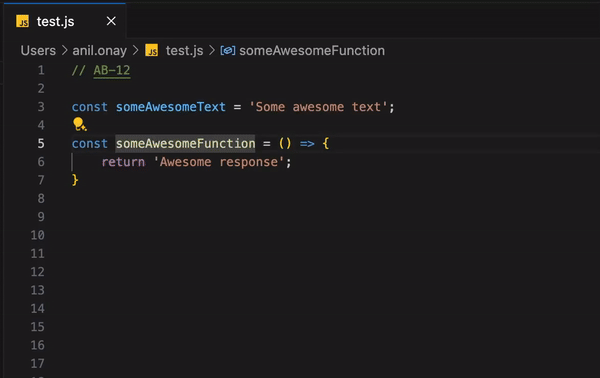

## Jira Issue Linker - README
Overview
The Jira Issue Linker is a VS Code extension that makes JIRA task keys (e.g., PROJ-123) in your code clickable. When clicked, these keys open the corresponding JIRA task in your browser. Additionally, hovering over a task key provides useful details about the task, such as its status, assigned developer, QA, and completion date.


## Usage


## Configurations
To use the extension, you need to configure your JIRA credentials and fields in your VS Code settings.

- Open Settings `(Ctrl + , or Cmd + ,)`.
Example configuration in `settings.json`:
```json
{   
  "jiraIssueLinker.jiraBaseURL": "https://yourcompany.atlassian.net",
  "jiraIssueLinker.jiraToken": "dXNlcm5hbWU6YXBpX3Rva2Vu",
  "jiraIssueLinker.jiraFields": {
    "developer": "customfield_1",
    "qa": "customfield_2",
    "completeDate": "customfield_3"
  }
}
```

## Features
- Clickable Task Keys: Click or Ctrl/Command + Click on any JIRA task key to open it in your browser.
- Hover Information: View task details (e.g., status, developer, QA, and completion date) by hovering over the task key.
- Task Caching: Reduces API requests by caching task data for 5 minutes.
- Customizable Fields: Configure which JIRA fields to display in hover information.
- Dynamic Decorations: Highlights JIRA task keys in your code with an underline and blue text.

## How to Use
- Open a file in VS Code.
- Write or paste a JIRA task key (e.g., PROJ-123) in your code.
- Hover over the task key to view details.
- Click or `Ctrl/Command + Click` on the task key to open it in your browser.
